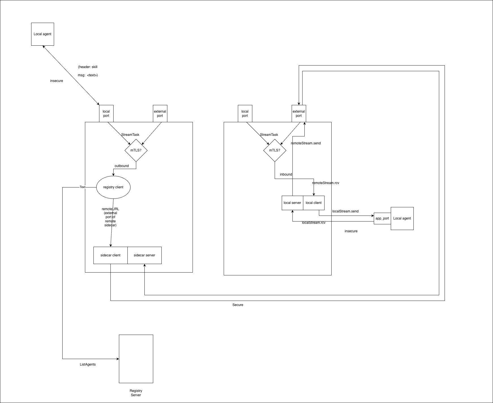

# A2A Registry Service

An Agent-to-Agent (A2A) Registry Service implementation in Go, designed to facilitate the discovery and management of autonomous agents. This project follows **Clean Architecture** principles to ensure modularity, testability, and maintainability.

## Architecture & Dataflow

The system facilitates communication between agents and sidecars. Below is the dataflow diagram illustrating the A2A sidecar communication:



## Features

-   **Agent Registry**: Full CRUD operations for registering, retrieving, listing, and deleting agent details.
-   **Dual Transport**: Supports both **HTTP (REST)** and **gRPC** interfaces simultaneously.
-   **Clean Architecture**: Separation of concerns with Domain, Ports, Services, and Adapters layers.
-   **Protocol Compliance**: Adheres to the A2A Protocol JSON Schema for `AgentCard`.
-   **In-Memory Storage**: Currently uses a thread-safe in-memory repository (Phase 1).

## Getting Started

### Prerequisites

-   **Go**: Version 1.21 or higher
-   **Make** (Optional, for running utility commands)

### Installation

1.  Clone the repository:
    ```bash
    git clone https://github.com/ThisaraWeerakoon/Agent-Mesh.git
    cd Agent-Mesh
    ```

2.  Install dependencies:
    ```bash
    go mod download
    ```

### Running the Server

Start the application using:

```bash
go run cmd/server/main.go
```

The server will start on:
-   **HTTP**: Port `3000`
-   **gRPC**: Port `50051`

## Documentation

For more detailed information, please refer to the following guides:

-   **[Developer Guide](DEVELOPER_GUIDE.md)**: In-depth look at architecture, design decisions, and codebase structure.
-   **[Usage Guide](USAGE_GUIDE.md)**: Step-by-step instructions on how to use the API (HTTP & gRPC) and run tests.

## Testing

Run the integration tests to verify the system:

```bash
go test -v ./tests/...
```
